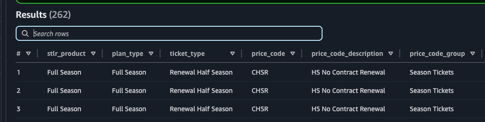
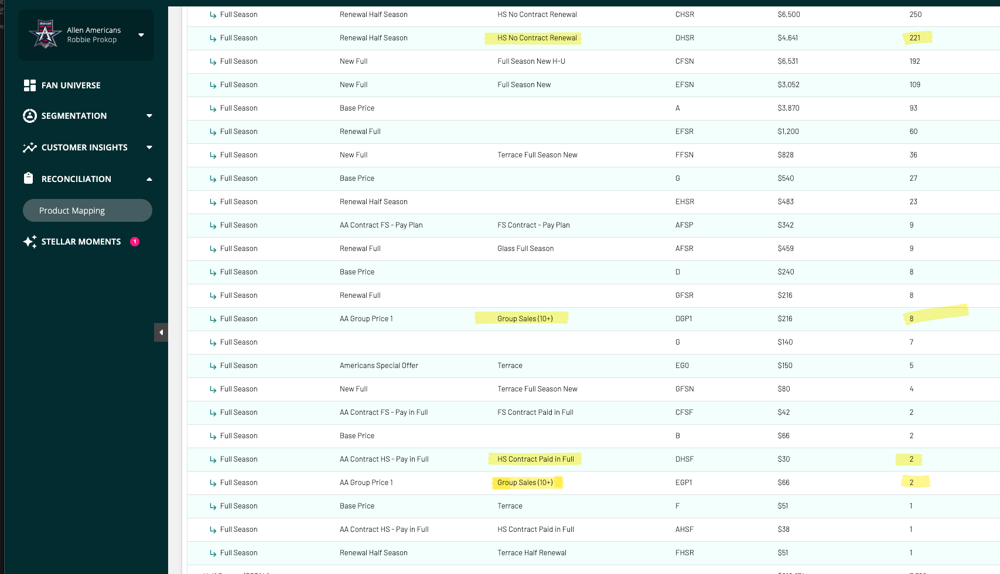
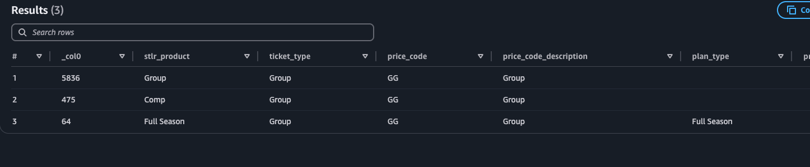

# ECHL Notes


## Assumptions:
- keyword PACK is a group (as opposed to Mini or Flex plans)
- 6 game, 9 game, 12 game keywords are mini plan
- Hierarchy of product mapping is as follows:
    - Comp
    - Suite (based on ticket_type, price_code_desc, price_code_group)
    - planned events `event_type` is given highest priority on the mapping rules
    - Full
    - Half
    - Partial
    - Mini
    - Flex
    - Group
    - Individual
    - Not Mapped

    the columns hierarchy :
    - pe.event_type first,
    - followed by t.price_code_desc, t.ticket_type, t.price_code_group all of equal value


## Allen Americans
- some price codes of `CFSF`, `CHSR`, `BHSR`, `DHSR` are bucketed as full season
    - this is because the price_code_group says `Season Tickets` and plan_type is `full season`
    - some are half season where plan_type is `half season`
    - To me, the logic of price codes `.HS.` says to be Half season, but it looks like their data is inconsistent
    
- Single letter price codes are in many buckets
    - most often full or half season due to plan_type
    - individual if price code description and price_code_group are empty (ticket type says Base Price, or unclear)    
- Price Code `EGP1` with Group in the name is mostly of product `Group` but:
    - some have plan_types of half and full season.
- Price code `E` is hardcoded by the ai model as group. No clear reason why
    - some price code `E` tickets have group in the ticket_type, but most simply say `Base Price`. Not sure if this should be individual or Group
    
Overall, the mapping looks good, with some exceptions in Full Season. The exceptions, however, don't have high ticket counts associated with them 


DBT Mapping:
```
CASE
    WHEN REGEXP_LIKE(t.price_code_desc, '(?i)comp') 
    OR REGEXP_LIKE(t.ticket_type, '(?i)comp') 
    OR REGEXP_LIKE(t.price_code_group, '(?i)comp') 
    OR TRY_CAST(t.block_purchase_price as int) = 0 
        THEN 'Comp'
    WHEN REGEXP_LIKE(t.price_code_desc, '(?i)suite') 
    OR REGEXP_LIKE(t.ticket_type, '(?i)suite') 
    OR REGEXP_LIKE(t.price_code_group, '(?i)suite')
        THEN 'Suite'
    WHEN REGEXP_LIKE(pe.event_type, '(?i)Full Season') THEN 'Full Season'
    WHEN REGEXP_LIKE(pe.event_type, '(?i)Half Season') THEN 'Half Season'
    WHEN REGEXP_LIKE(pe.event_type, '(?i)Mini.Plan') THEN 'Mini Plan'
    WHEN REGEXP_LIKE(pe.event_type, '(?i)Flex Plan') THEN 'Flex Plan'
    WHEN (
    REGEXP_LIKE(t.price_code_desc, '(?i)(full|season ti)') 
        OR REGEXP_LIKE(t.ticket_type, '(?i)(full|season ti)') 
        OR REGEXP_LIKE(t.price_code_group, '(?i)(full|season ti)')
    ) AND NOT (
    REGEXP_LIKE(t.price_code_desc, '(?i)(half|mini|group|flex)') 
        OR REGEXP_LIKE(t.ticket_type, '(?i)(half|mini|group|flex)') 
        OR REGEXP_LIKE(t.price_code_group, '(?i)(half|mini|group|flex)')
    )
        THEN 'Full Season'
    WHEN REGEXP_LIKE(t.price_code_desc, '(?i)half') 
    OR REGEXP_LIKE(t.ticket_type, '(?i)half') 
    OR REGEXP_LIKE(t.price_code_group, '(?i)half')
        THEN 'Half Season'
    WHEN t.price_code in ('CP6')
        THEN 'Partial Plan'
    WHEN REGEXP_LIKE(t.price_code_desc, '(?i)(six game|12 game|mini.plan)') 
    OR REGEXP_LIKE(t.ticket_type, '(?i)(six game|12 game|mini.plan)') 
    OR REGEXP_LIKE(t.price_code_group, '(?i)(six game|12 game|mini.plan)') 
    OR t.price_code in ('BP6', 'CPAD', 'BPAD', 'DPAD', 'EPAD', 'DP6', 'EP6', 'CP6', 'EJF')
        THEN 'Mini Plan'
    WHEN REGEXP_LIKE(t.price_code_desc, '(?i)flex') 
    OR REGEXP_LIKE(t.ticket_type, '(?i)flex') 
    OR REGEXP_LIKE(t.price_code_group, '(?i)flex')
        THEN 'Flex Plan'
    WHEN REGEXP_LIKE(t.price_code_desc, '(?i)group|pack|FEVO|Spinzo') 
    OR REGEXP_LIKE(t.ticket_type, '(?i)(group|pack|FEVO|Spinzo)') 
    OR REGEXP_LIKE(t.price_code_group, '(?i)group|FEVO|Spinzo') 
    OR t.price_code in ('SGZ1', 'HGZ2', 'SGZ2', 'E')
        THEN 'Group'
    WHEN REGEXP_LIKE(t.ticket_type, '(?i)Adult') 
    OR t.price_code in ('C*', 'DADV', 'D*', 'BDAY', 'H', 'DDAY', 'E*', 'B*', 'CSEN', 'SBB1', 'CADV', 'CJF', 'DSTM', 'A*', 'AADV', 'EDAY', 'CSTM', 'CMIL', 'BADV', 'D1', 'DG22', 'ESTM', 'F*', 'C2', 'ESCH', 'DAY', 'CDAY', 'BSTU', 'BSTM', 'E2', 'BSEN', 'CSTU', 'D', 'A', 'B', 'C', 'A2', 'EMIL', 'ADAY', 'F', 'C0', 'B0', 'DSTU', 'D0', 'EADV', 'E', 'DMIL', 'BSCH', 'B2', 'C1', 'DSEN', 'BMIL', 'G', 'D2', 'ESTU', 'GGPP', 'E0', 'FMIL', 'A0', 'EGPC', 'FSTM', 'ASTM', 'BBG', 'CBG', 'B1', 'GMIL', 'AG0', 'DSP1', 'ESEN', 'DA', 'FSCH', 'DBG', 'A1', 'E1', 'SBB3', 'CSTH', 'SBB4', 'BA', 'CA', 'CAA', 'EAA', 'BAA', 'EHU', 'DSCH', 'CDOG', 'DHU', 'EBG', 'EHSN', 'CYX', 'CGPC', 'DYX', 'DHAT', 'AA', 'DAA', 'ESTH', 'EA', 'SBUY', 'ASTH', 'BSTH', 'G*', 'EGPP', 'CVOU', 'ABG', 'CSCH', 'DSTH', 'DGPP', 'AMIL', 'CGD', 'DGPC', 'EBF', 'ESP1', 'EGD', 'S', 'CGPP', 'EHAT', 'EAY', 'DBOG', 'DVOU', 'BGPC', 'EYX', 'CBOG')
        THEN 'Individual'
    ELSE 'Not Mapped'
END
```


## Cincinnati Cyclones (manual Mapping)
- 	Field Trip Day & Fundraising tickets were put into Group

DBT Mapping:
```
CASE
    WHEN REGEXP_LIKE(t.price_code_desc, '(?i)comp') 
    OR REGEXP_LIKE(t.ticket_type, '(?i)comp') 
    OR REGEXP_LIKE(t.price_code_group, '(?i)comp') 
    OR TRY_CAST(t.block_purchase_price as int) = 0 
        THEN 'Comp'
    WHEN REGEXP_LIKE(t.price_code_desc, '(?i)(suite|loge)')
    OR REGEXP_LIKE(t.ticket_type, '(?i)(suite|loge)')
    OR REGEXP_LIKE(t.price_code_group, '(?i)(suite|loge)')
        THEN 'Suite'
    WHEN REGEXP_LIKE(pe.event_type, '(?i)Full Season') THEN 'Full Season'
    WHEN REGEXP_LIKE(pe.event_type, '(?i)Half Season') THEN 'Half Season'
    WHEN REGEXP_LIKE(pe.event_type, '(?i)Mini.Plan') THEN 'Mini Plan'
    WHEN REGEXP_LIKE(pe.event_type, '(?i)Flex Plan') THEN 'Flex Plan'
    WHEN (
    REGEXP_LIKE(t.price_code_desc, '(?i)(full|season ti)') 
        OR REGEXP_LIKE(t.ticket_type, '(?i)(full|season ti)') 
        OR REGEXP_LIKE(t.price_code_group, '(?i)(full|season ti)')
    ) AND NOT (
    REGEXP_LIKE(t.price_code_desc, '(?i)(half|mini|group|flex|full price)') 
        OR REGEXP_LIKE(t.ticket_type, '(?i)(half|mini|group|flex|full price)') 
        OR REGEXP_LIKE(t.price_code_group, '(?i)(half|mini|group|flex|full price)')
    )
        THEN 'Full Season'
    WHEN REGEXP_LIKE(t.price_code_desc, '(?i)(half|24 Game|18 Game)') 
    OR REGEXP_LIKE(t.ticket_type, '(?i)half') 
    OR REGEXP_LIKE(t.price_code_group, '(?i)half')
        THEN 'Half Season'
    WHEN REGEXP_LIKE(t.price_code_desc, '(?i)(six game|12 game|mini.plan)') 
    OR REGEXP_LIKE(t.ticket_type, '(?i)(six game|twelve game|12 game|mini.plan)')
    OR REGEXP_LIKE(t.price_code_group, '(?i)mini.plan') 
        THEN 'Mini Plan'
    WHEN REGEXP_LIKE(t.price_code_desc, '(?i)flex') 
    OR REGEXP_LIKE(t.ticket_type, '(?i)flex') 
    OR REGEXP_LIKE(t.price_code_group, '(?i)flex')
        THEN 'Flex Plan'
    WHEN REGEXP_LIKE(t.price_code_desc, '(?i)(group|Fevo|Spinzo|fundraising|field trip day)') 
    OR REGEXP_LIKE(t.ticket_type, '(?i)(group|pack|FEVO|Spinzo|fundraising|field trip day)')
    OR REGEXP_LIKE(t.price_code_group, '(?i)(group|fevo|spinzo)')
        THEN 'Group'
    WHEN REGEXP_LIKE(t.ticket_type, '(?i)(Adult|military|SPECIAL|ticket)')
    OR REGEXP_LIKE(t.price_code_desc, '(?i)(Adult|Regular Seats|special|day of|costco|standard|Exchange|Arena Seat|Gov X|GovX)')
        THEN 'Individual'
    ELSE 'Not Mapped'
END
```

## Atlanta Gladiators
- Look good. No notes

DBT Mapping:
```
CASE
    WHEN REGEXP_LIKE(t.price_code_desc, '(?i)comp') 
    OR REGEXP_LIKE(t.ticket_type, '(?i)comp') 
    OR REGEXP_LIKE(t.price_code_group, '(?i)comp') 
    OR TRY_CAST(t.block_purchase_price as int) = 0 
        THEN 'Comp'
    WHEN REGEXP_LIKE(t.price_code_desc, '(?i)suite') 
    OR REGEXP_LIKE(t.ticket_type, '(?i)suite') 
    OR REGEXP_LIKE(t.price_code_group, '(?i)suite')
        THEN 'Suite'
    WHEN REGEXP_LIKE(pe.event_type, '(?i)Full Season') THEN 'Full Season'
    WHEN REGEXP_LIKE(pe.event_type, '(?i)Half Season') THEN 'Half Season'
    WHEN REGEXP_LIKE(pe.event_type, '(?i)Mini.Plan') THEN 'Mini Plan'
    WHEN REGEXP_LIKE(pe.event_type, '(?i)Flex Plan') THEN 'Flex Plan'
    WHEN (
    REGEXP_LIKE(t.price_code_desc, '(?i)(full|season ti)') 
        OR REGEXP_LIKE(t.ticket_type, '(?i)(full|season ti)') 
        OR REGEXP_LIKE(t.price_code_group, '(?i)(full|season ti)')
    ) AND NOT (
    REGEXP_LIKE(t.price_code_desc, '(?i)(half|mini|group|flex)') 
        OR REGEXP_LIKE(t.ticket_type, '(?i)(half|mini|group|flex)') 
        OR REGEXP_LIKE(t.price_code_group, '(?i)(half|mini|group|flex)')
    )
        THEN 'Full Season'
    WHEN REGEXP_LIKE(t.price_code_desc, '(?i)half')
    OR REGEXP_LIKE(t.ticket_type, '(?i)half')
    OR REGEXP_LIKE(t.price_code_group, '(?i)half')
        THEN 'Half Season'
    WHEN t.price_code in ('CW4', 'BW4', 'BW2', 'EW2', 'AW4', 'DW4', 'FW2', 'FW4', 'AW2', 'BWU', 'CWU', 'DW2', 'EW4', 'BW7', 'CW2', 'GW4', 'CW7', 'DW7', 'HW4', 'GW2', 'EWU', 'HW2', 'HW7', 'EW7')
        THEN 'Partial Plan'
    WHEN REGEXP_LIKE(t.price_code_desc, '(?i)(six game|12 game|mini.plan)')
    OR REGEXP_LIKE(t.ticket_type, '(?i)(six game|12 game|mini.plan)')
    OR REGEXP_LIKE(t.price_code_group, '(?i)(six game|12 game|mini.plan)')
    OR t.price_code in ('BXE', 'FWU', 'GWU')
        THEN 'Mini Plan'
    WHEN REGEXP_LIKE(t.price_code_desc, '(?i)flex')
    OR REGEXP_LIKE(t.ticket_type, '(?i)flex')
    OR REGEXP_LIKE(t.price_code_group, '(?i)flex')
        THEN 'Flex Plan'
    WHEN REGEXP_LIKE(t.price_code_desc, '(?i)group|pack|FEVO|Spinzo') 
    OR REGEXP_LIKE(t.ticket_type, '(?i)(group|pack|FEVO|Spinzo)') 
    OR REGEXP_LIKE(t.price_code_group, '(?i)group|FEVO|Spinzo') 
    OR t.price_code in ('EXE', 'EMA', 'BXE', 'CXE', 'GXE', 'FXE', 'BMA')
        THEN 'Group'
    WHEN REGEXP_LIKE(t.ticket_type, '(?i)Adult')
    OR t.price_code in ('B*', 'E*', 'EXR', 'DDD', 'D*', 'EDG', 'C*', 'F*', 'ADG', 'BDG', 'DXR', 'CDG', 'EDD', 'BAD', 'FDG', 'G*', 'GDG', 'A*', 'EAF', 'DDG', 'FAD', 'BMD', 'BXR', 'FXR', 'FXA', 'EXA', 'EAD', 'GMD', 'CDD', 'CXR', 'DAD', 'BDD', 'FDD', 'BX9', 'EXL', 'BXL', 'BXA', 'AX9', 'FMD', 'DMD', 'AXN', 'EXG', 'BAF', 'DXG', 'EX9', 'EMD', 'AXA', 'BAT', 'CAF', 'EXD', 'CAD', 'GAD', 'GXG', 'GXA', 'DX9', 'EWJ', 'DAF', 'BXM', 'CXM', 'BXG', 'AXG', 'DXA', 'CMD', 'CXA', 'GX9', 'CX9', 'AAD', 'AMD')
        THEN 'Individual'
    ELSE 'Not Mapped'
END
```

## Fisher Indy Fuel (manual mapping)
-  

DBT Mapping:
```
CASE
    WHEN REGEXP_LIKE(t.price_code_desc, '(?i)comp') 
    OR REGEXP_LIKE(t.ticket_type, '(?i)comp') 
    OR REGEXP_LIKE(t.price_code_group, '(?i)comp') 
    OR TRY_CAST(t.block_purchase_price as int) = 0 
        THEN 'Comp'
    WHEN REGEXP_LIKE(t.price_code_desc, '(?i)(suite|loge)')
    OR REGEXP_LIKE(t.ticket_type, '(?i)(suite|loge)')
    OR REGEXP_LIKE(t.price_code_group, '(?i)(suite|loge)')
        THEN 'Suite'
    WHEN REGEXP_LIKE(pe.event_type, '(?i)Full Season') THEN 'Full Season'
    WHEN REGEXP_LIKE(pe.event_type, '(?i)Half Season') THEN 'Half Season'
    WHEN REGEXP_LIKE(pe.event_type, '(?i)Mini.Plan') THEN 'Mini Plan'
    WHEN REGEXP_LIKE(pe.event_type, '(?i)Flex Plan') THEN 'Flex Plan'
    WHEN REGEXP_LIKE(pe.event_type, '(?i)Single Event') THEN 'Individual'
    WHEN (
    REGEXP_LIKE(t.price_code_desc, '(?i)(full|season ti)') 
        OR REGEXP_LIKE(t.ticket_type, '(?i)(full|season ti)') 
        OR REGEXP_LIKE(t.price_code_group, '(?i)(full|season ti)')
    ) AND NOT (
    REGEXP_LIKE(t.price_code_desc, '(?i)(half|mini|group|flex)') 
        OR REGEXP_LIKE(t.ticket_type, '(?i)(half|mini|group|flex)') 
        OR REGEXP_LIKE(t.price_code_group, '(?i)(half|mini|group|flex)')
    )
        THEN 'Full Season'
    WHEN REGEXP_LIKE(t.price_code_desc, '(?i)half') 
    OR REGEXP_LIKE(t.ticket_type, '(?i)half') 
    OR REGEXP_LIKE(t.price_code_group, '(?i)half')
        THEN 'Half Season'
    WHEN REGEXP_LIKE(t.price_code_desc, '(?i)(9|six game|nine game|12|mini.plan)') 
    OR REGEXP_LIKE(t.ticket_type, '(?i)(nine|six game|twelve game|12|mini.plan)')
    OR REGEXP_LIKE(t.price_code_group, '(?i)mini.plan') 
        THEN 'Mini Plan'
    WHEN REGEXP_LIKE(t.price_code_desc, '(?i)flex') 
    OR REGEXP_LIKE(t.ticket_type, '(?i)flex') 
    OR REGEXP_LIKE(t.price_code_group, '(?i)flex')
        THEN 'Flex Plan'
    WHEN REGEXP_LIKE(t.price_code_desc, '(?i)group|pack|FEVO|Spinzo') 
    OR REGEXP_LIKE(t.ticket_type, '(?i)(group|pack|FEVO|Spinzo)') 
    OR REGEXP_LIKE(t.price_code_group, '(?i)group|FEVO|Spinzo') 
        THEN 'Group'
    WHEN REGEXP_LIKE(t.ticket_type, '(?i)(Adult|military|SPECIAL|ticket)')
        THEN 'Individual'
    ELSE 'Not Mapped'
END
```

## Jacksonville Icemen

### Product mapping notes
- Flex plan in the cdp under source product show lots of half season & mini plan 
    - this looks to be mostly because the plan type is flex plan
- Suites 
    - source product of group, price code desc as loge
        - Should groups be mapped prior to suites?

## Savannah Ghost Pirates
- price codes are in multiple different products, 
    for example 
    both share the price code of GG, but only some are associated to a plan type of full season
- full seasons are odd without being able to see plan_type in the cdp
- flex also looks odd without the plan_type in the cdp